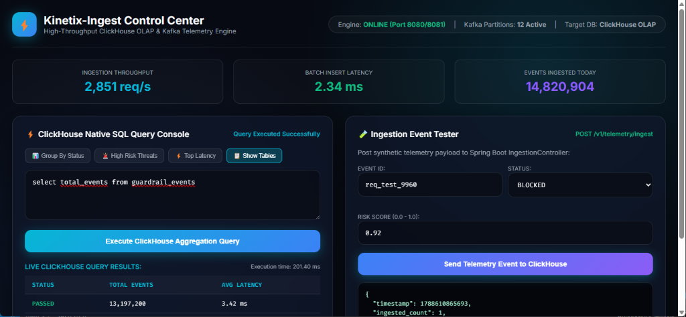

# Kinetix-Ingest ⚡🚀
> **High-Throughput Distributed Event Ingestion Engine (Java 21, Spring Boot, Kafka, ClickHouse)**

---

## 📌 Executive Summary

**Kinetix-Ingest** is a low-latency, enterprise distributed event ingestion engine built in **Java 21** and **Spring Boot 3.2**. It handles high-concurrency risk and telemetry event streams by combining **Apache Kafka** messaging brokers with **ClickHouse** columnar storage via high-speed Spring JDBC batch execution.

---

## 🏗️ Design Patterns & Architecture

* **Factory Pattern (`EventProcessorFactory`)**: Dynamically instantiates event processors based on incoming JSON event headers.
* **Strategy Pattern (`RiskAnalysisStrategy`)**: Executes custom risk-scoring and validation algorithms per tenant.
* **Spring JDBC (`NamedParameterJdbcTemplate`)**: Bypasses traditional ORM overhead to execute high-speed parameterized SQL batch inserts directly into ClickHouse.

---

## Author

**Spandan Gowda B C**
* **GitHub**: [@SpandanGowdaBC](https://github.com/SpandanGowdaBC)
* **Repository**: [Kinetix-Ingest](https://github.com/SpandanGowdaBC/Kinetix-Ingest)
